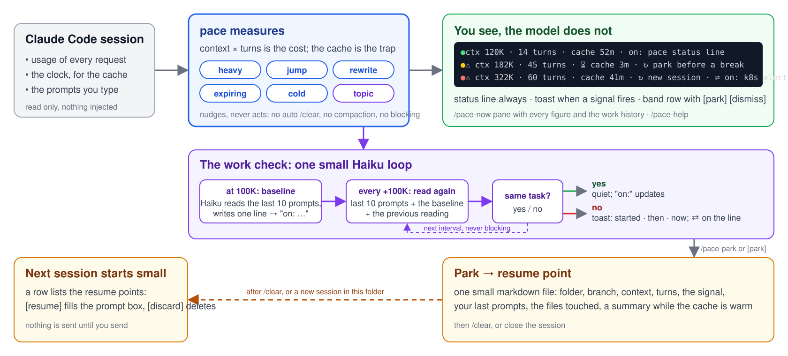

# pace

**Know when a Claude Code session is getting expensive, and leave it cleanly.**

A Claude Code mod. Every turn re-reads the whole context, so a session costs context × turns, and a
cold prompt cache re-writes it all. pace shows you the cost while you work, tells you when the work
has drifted, and saves your place so the next session starts small. It nudges, never acts, and
nothing it shows enters the model's context.

## What it does

- **Measures every request:** context size, turns, what the cache did. Subagents excluded.
- **Keeps one line under the prompt:** 🟢 🟡 🔴 by cost, context, turns, minutes of cache left.
- **Raises six signals**, once per crossing: heavy, jump, rewrite, expiring, cold, topic.
- **Shows each on the right surface:** a toast for a moment, a band row with `park` and `dismiss` for a state.
- **Runs one small Haiku loop:** at 100K it reads your last prompts and writes what the work is, shown after `on:`; every 100K it reads again and toasts started · then · now when the task changed.
- **Parks:** one small markdown resume point with the facts and a cheap summary while the cache is warm.
- **Resumes:** into the prompt box, so you read before you send.
- **Answers on demand:** `/pace-now` with every figure and the work history, `/pace-help`. No command uses a model turn.
- **Is configurable:** every threshold, the status line, the Haiku loop, each with an off switch.
- **Is extendable:** other mods can listen to its signals or add park targets.

[Install](docs/install.md) · [Commands and keys](docs/commands.md) · [Settings](docs/settings.md) · [How it talks to you](docs/surfaces.md) · [Design](DESIGN.md)
