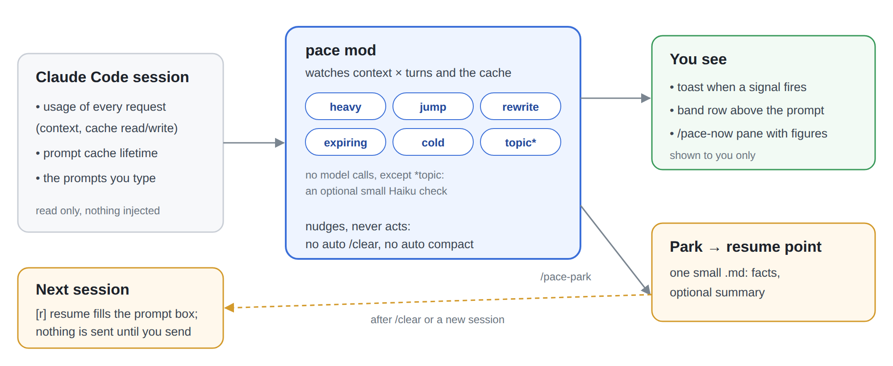

# pace

**Know when a Claude Code session is getting expensive, and leave it cleanly.**

pace is a Claude Code mod. It keeps one line under the prompt with the size of the session and the
life left in its prompt cache, and it speaks up when the session gets heavy or the cache is about
to go cold. It can also save where you are, so a fresh session picks up from there. It only nudges:
it never clears, compacts or blocks anything, and nothing it shows enters the model's context.



## Why

Every turn re-reads the whole context, so a session costs roughly **context × turns**. A long
session gets expensive without any signal. Coming back after the prompt cache has expired is
worse: the next turn re-writes the whole context at write price (1.25–2× input) instead of read
price (0.1×). Claude Code has point-in-time views (`/context`, `/usage`, `/cost`), but it gives you
no live nudge. pace adds one.

## Principles

- **No context cost.** Toasts, the band row and panes are shown only to you. Nothing enters the
  model's context.
- **Nudge, never act.** pace never runs `/clear` or compacts for you, and it blocks nothing. It
  says what happened and what it costs. The suggestion text is yours to set, for example "save
  state, then /clear".
- **Tokens, not time.** pace measures a session by its context size and turn count, not by
  minutes.
- **Generic.** pace reads only what Claude Code hands it. It knows nothing about your tracker, your
  repos or your workflow.
- **Deterministic.** pace calls no model, with one optional exception: the topic check (see
  below), which you can turn off.

## Install

Requires Claude Code 2.1.287 or later.

Claude Code loads a plugin folder placed in `~/.claude/skills/` in every session:

```sh
git clone https://github.com/asitha-w/pace.git
ln -s "$PWD/pace" ~/.claude/skills/pace
```

pace loads in the next session as `pace@skills-dir`. To try it in a single session instead, run
`claude --plugin-dir ./pace`.

## How pace talks to you

A mod is only useful if it reaches you where you already look. pace uses six of the surfaces Claude
Code gives a mod, each for one job, and nothing it draws enters the model's context.

| Surface | Where | pace uses it for | Lives |
|---|---|---|---|
| **Status line** | one line under the prompt | the standing figures: `ctx 182K · 45 turns · cache 41m`; `⚠` once the context passes `warn`, `⏳` with a countdown in the last `expiring_minutes`, `❄` with the re-write size once the cache is cold and big; the hint text after `↻` once the session is past `high` or cold and big | always, updated after each request and every 15 s; `/clear` drops it |
| **Toast** | a short notice that fades | each crossing, once: `heavy`, `jump`, `rewrite`, `expiring`, `topic`; park and resume confirmations | a few seconds |
| **Band row** | a row above the prompt with buttons | the one signal that needs an action: `cold`, `expiring`, `topic`, `heavy` in that priority, with `park` and `dismiss`; the resume points for this folder with `resume`, `discard`, `all` | until it clears, or you dismiss it |
| **Pane** | a framed region beside the transcript | `/pace-now` figures; the park dialog (target, summary on/off); the resume list | until you close it (`Esc`, `Ctrl+X X`, or `/pace-close`) |
| **Prompt box** | the text you are about to send | resume puts the note there, so you read it before anything reaches the model | until you send or clear it |
| **Slash commands** | `/pace-…` | one word for each of the above, so nothing depends on a button being visible | — |

The rules behind the split:

- **The status line is the only standing surface.** It is quiet by design: no colour, no sentence,
  the same three fields every time, so you can read it without reading it. Turn it off with
  `status_line` = `off`.
- **A toast marks a moment; a band row marks a state.** Something that happened once (a big tool
  result, a cache re-write) gets a toast and nothing more. Something that stays true until you act
  (a cold cache, a new topic in a heavy session) gets a row that stays, with the action next to it.
- **Nothing standing is model-facing.** Every surface above is drawn for you. The topic check is
  the only model call, it goes to Haiku, and its answer comes back as a toast, not as context.
- **Every button has a command.** The band and the panes can be hidden by a narrow terminal or
  by `Ctrl+X` focus rules; `/pace-park`, `/pace-resume`, `/pace-dismiss` and `/pace-close` do the
  same from the prompt.
- **Keys.** `Ctrl+X` then `Tab` focuses the band and panes, `Tab` and the arrows move, `Enter` or
  the digit presses, `Esc` returns to the prompt.

## Signals

| Signal | Means | Shown as |
|---|---|---|
| `heavy` | the context is big, and every turn re-reads it | a toast at `warn`, a band row while above `high` |
| `jump` | one step (a big file or log) added ≥ `big_result` tokens | a toast |
| `expiring` | the cache goes cold in a few minutes while you are idle | a toast, then a countdown row |
| `cold` | the cache went cold, so the next prompt re-writes the whole context | a band row until the next turn or `/clear` |
| `rewrite` | the cache was rebuilt mid-session, for example after a model switch | a toast naming the cause |
| `topic` | you started a new task in a big session | a toast, two reminders, then a band row |

Each toast fires once per crossing. Only one pace row shows in the band at a time, in this
priority: cold > expiring > topic > heavy.

**Topic check.** This is pace's only model call. Once the context is past `warn`, pace sends your
last few prompts and the new one to Haiku. The call costs a few hundred tokens and adds nothing to
your session's context. Haiku answers whether the new prompt starts a different task. Set
`topic_check` to `off` to stop the call.

## Park and resume

`/pace-park` (or `[p]` on the band) writes a resume point: one small markdown file. It always holds
the facts: cwd, branch, context, turns, the signal, the last prompts and the files touched. It can
also hold a summary written by the model, which is cheap while the cache is warm.

After `/clear`, or in a new session, the band lists the resume points for this folder:

- `[r] resume` puts the note into the prompt box. The file is deleted once you send that prompt.
- `[d] discard` deletes the note.

Nothing reaches the model until you send.

## Commands

| Command | Does |
|---|---|
| `/pace-now` | opens a pane with context, window %, turns, cache countdown, re-writes, limits, cost and active signals |
| `/pace-park` / `/pace-resume` | write a resume point / list resume points |
| `/pace-dismiss` / `/pace-close` | hide the alert row / close the panes |
| `/pace-help` | lists commands, keys, and how to turn things off |

None of these commands uses a model turn. The bundled `pace:help` skill answers questions about the
alerts in plain words.

## Settings

You set these at install. Change them later with `/plugin configure pace` or in `/config`. Every
setting has a default.

| Setting | Default |
|---|---|
| `park_dir` | `~/.local/state/pace/parked` |
| `summary` (`never` / `warm` / `always`) | `warm` |
| `resume_scope` (`folder` / `everywhere`) | `folder` |
| `warn` / `high` / `cold_warn` | 150 000 / 250 000 / 100 000 |
| `big_result` | 30 000 |
| `cache_ttl_minutes` / `expiring_minutes` | 60 / 5 |
| `hint` | `suggestion: start a new session` |
| `status_line` (`on` / `off`) | `on` |
| `topic_check` (`off` / `when heavy`) | `when heavy` |

## Extending

pace adds a `$.pace` noun with four events: `pace.signal`, `pace.targets`, `pace.park` and
`pace.now`. Another mod that lists `"dependencies": ["pace"]` can use them to log signals, reword
them, or add park targets such as an issue tracker. The contract is in
[`types/index.d.ts`](types/index.d.ts).

## Related projects

[Cairn](https://github.com/asitha-w/cairn) (`crn`) keeps your work as a graph of plain markdown
nodes: what each piece of work is doing, what it waits on, and what was decided. The two projects
split the job:

- **pace** tells you when to leave a session.
- **Cairn** remembers where the work stands, so the next session starts small.

They connect through pace's extension contract. A small mod can answer `pace.targets` and
`pace.park` to park straight into a Cairn work node, for example as a `crn log` line. Neither
project depends on the other.

## Development

```sh
claude plugin validate .
claude plugin test .
```

The design and the reasoning behind each threshold are in [DESIGN.md](DESIGN.md).
